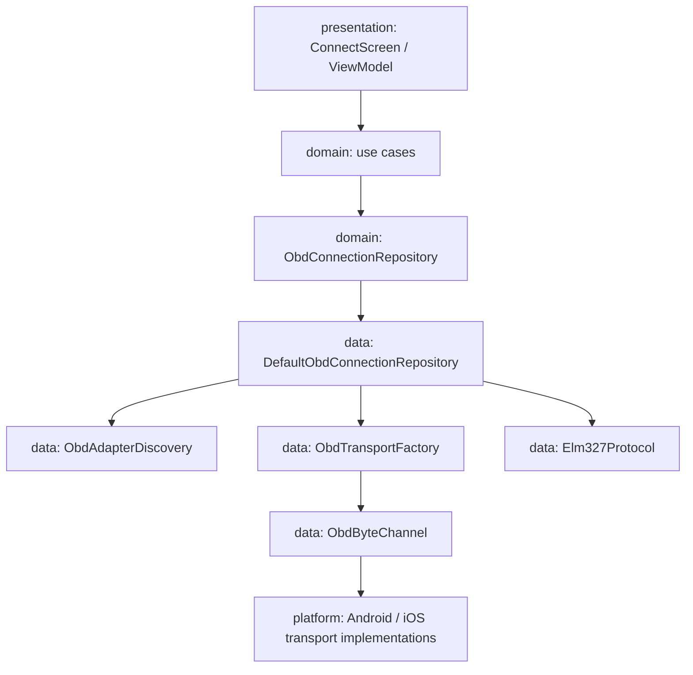
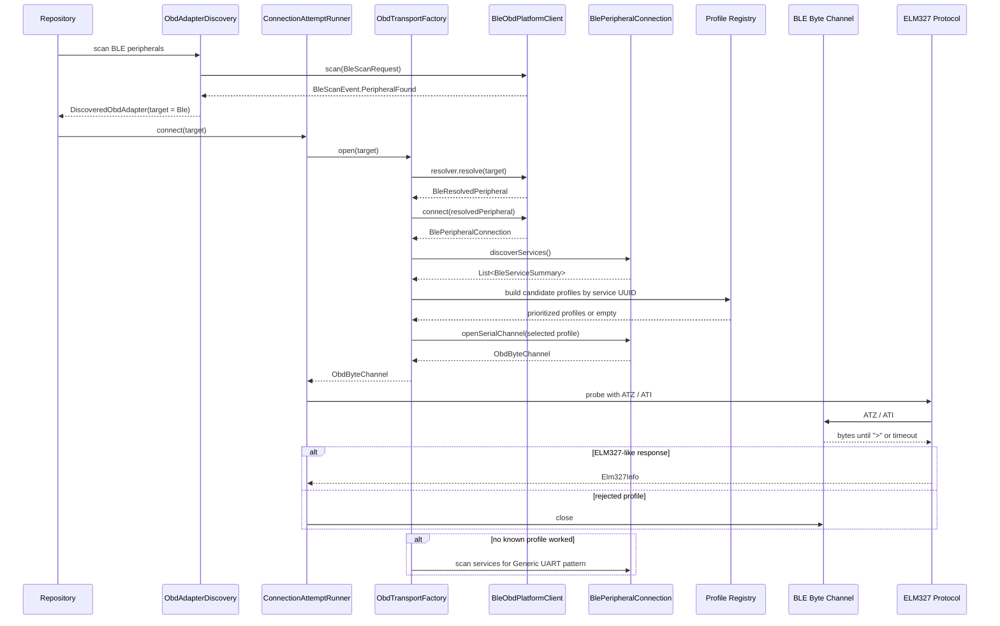
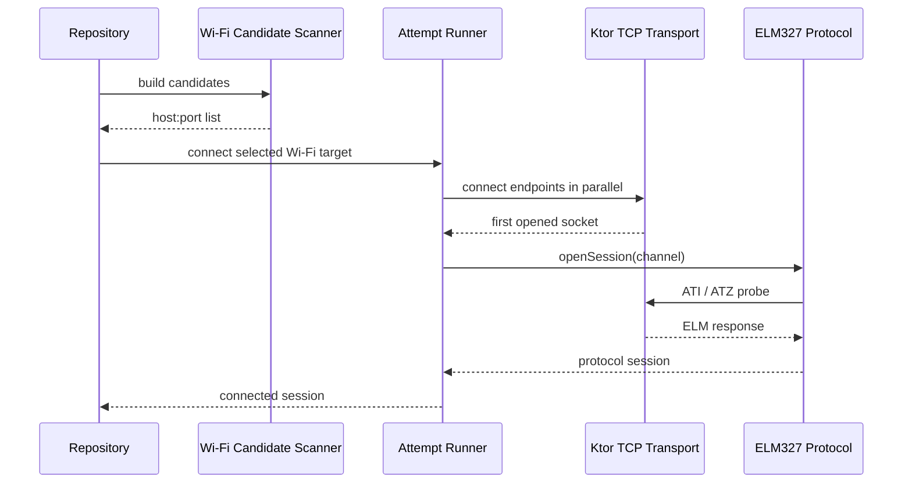
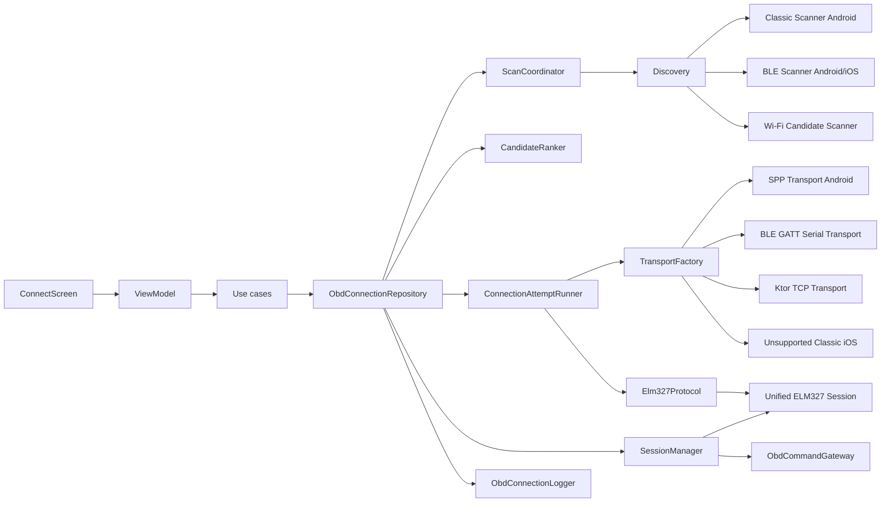

# CarInspector: архитектура OBD-подключения

## Цель

Спроектировать бизнес-функцию подключения CarInspector к OBD-II адаптеру через три транспорта:

- Bluetooth Classic SPP: только Android, только уже спаренные устройства.
- Bluetooth Low Energy: Android и iOS, с перебором известных UART-профилей и безопасным fallback для неизвестных адаптеров.
- Wi-Fi TCP: Android и iOS, TCP-сокет поверх сети адаптера, с автоматическим перебором вероятных host:port.

Поверх всех транспортов работает один протокол: ELM327 AT-команды.

Главная идея архитектуры: UI и domain не знают, как именно устроен Bluetooth, BLE или Wi-Fi. Они работают с единым OBD connection API. Все платформенные детали, UUID, сокеты, permissions, pairing и BLE MTU живут ниже, в data/platform слоях.

---

## Что считаем успешным подключением

Подключение к адаптеру считается успешным не после открытия сокета или GATT-соединения, а после ELM327 handshake:

1. Транспорт открыт.
2. Создана serial-like сессия чтения/записи байтов.
3. Выполнена минимальная ELM327-инициализация.
4. На команду `ATI` или `ATZ` получен валидный ответ с prompt `>`.
5. Репозиторий перевёл состояние в `Connected`.

Это важно: Bluetooth/Wi-Fi connection может быть технически открыт, но адаптер может не отвечать как ELM327.

---

## Слои



### `presentation`

Отвечает только за пользовательский сценарий:

- показать одну основную кнопку `Найти адаптер`;
- показать найденные адаптеры;
- показать общий прогресс поиска без выбора типа транспорта;
- показать понятную ошибку и следующий шаг;
- отправить intent: scan, connect, disconnect, retry.

UI не спрашивает пользователя, какой тип адаптера у него: Classic, BLE или Wi-Fi. Пользователь видит единый список найденных кандидатов и выбирает адаптер по названию.

Presentation не содержит UUID, host:port, ELM327-команд и Android/iOS API.

### `domain`

Описывает бизнес-смысл подключения:

- какие адаптеры доступны;
- какой транспорт поддерживается на текущей платформе;
- что такое состояние подключения;
- какие ошибки видит пользователь;
- какие use cases запускают scan/connect/disconnect.

Domain не зависит от Android, iOS, Ktor, CoreBluetooth, BluetoothGatt.

### `data`

Реализует бизнес-правила подключения:

- собирает кандидатов из разных scanner-ов;
- ранжирует кандидатов;
- перебирает стратегии подключения;
- открывает transport;
- выполняет ELM327 handshake;
- маппит низкоуровневые ошибки в domain errors.

### `platform`

Содержит реальные платформенные реализации:

- Android Bluetooth Classic bonded device scanner и SPP socket.
- Android BLE scanner/GATT client.
- iOS BLE scanner/CoreBluetooth adapter.
- Android/iOS Wi-Fi network snapshot provider.
- Ktor TCP socket для Wi-Fi транспорта.
- iOS заглушка для Bluetooth Classic.

---

## Рекомендуемая структура пакетов

Функция должна жить в `shared`, потому что домен, репозитории, ELM327-протокол и Wi-Fi TCP нужны на обеих платформах.

```text
shared/src/commonMain/kotlin/maryino/district/carinspector/obd/
  domain/
    model/
    repository/
    usecase/
  data/
    repository/
    discovery/
    transport/
    elm327/
  di/

shared/src/androidMain/kotlin/maryino/district/carinspector/obd/
  platform/
    classic/
    ble/
    wifi/
    di/

shared/src/iosMain/kotlin/maryino/district/carinspector/obd/
  platform/
    classic/
    ble/
    wifi/
    di/
```

Если проект вырастет, эту функцию можно вынести в `:feature:obd-connection` и `:core:obd`, но на текущем размере проекта лучше начать внутри `shared`, без преждевременного дробления модулей.

### Gradle dependencies

В текущем проекте `shared` почти пустой, поэтому перед реализацией OBD нужно явно добавить общие зависимости, а не прятать их в platform коде.

Минимальный набор для `shared/commonMain`:

```text
kotlinx-coroutines-core      Flow, Mutex, structured concurrency
kotlinx-datetime             Instant
ktor-network                 TCP socket для Wi-Fi transport
multiplatform-settings       AdapterMemory / remembered adapter
koin-core                    DI common bindings, если проект выбирает Koin
```

Platform dependencies:

```text
androidMain:
  Android Bluetooth/BLE APIs через SDK
  Android runtime permission helpers
  Android manifest permissions в app module

iosMain:
  CoreBluetooth interop
  Network/Wi-Fi snapshot helpers через platform APIs
```

### Android manifest permissions

Android manifest contract живёт в `composeApp/src/androidMain/AndroidManifest.xml`, потому что `composeApp` владеет Android application manifest. `shared/androidMain` и platform scanner-ы могут проверять runtime permissions и system state, но не должны скрыто полагаться на отсутствующие manifest entries.

Текущий baseline для OBD transport-ов:

```xml
<uses-permission android:name="android.permission.INTERNET" />
<uses-permission android:name="android.permission.ACCESS_NETWORK_STATE" />
<uses-permission android:name="android.permission.ACCESS_WIFI_STATE" />

<uses-permission
    android:name="android.permission.BLUETOOTH"
    android:maxSdkVersion="30" />
<uses-permission
    android:name="android.permission.BLUETOOTH_ADMIN"
    android:maxSdkVersion="30" />
<uses-permission
    android:name="android.permission.ACCESS_FINE_LOCATION"
    android:maxSdkVersion="30" />

<uses-permission
    android:name="android.permission.BLUETOOTH_SCAN"
    android:usesPermissionFlags="neverForLocation" />
<uses-permission android:name="android.permission.BLUETOOTH_CONNECT" />

<uses-feature
    android:name="android.hardware.bluetooth"
    android:required="false" />
<uses-feature
    android:name="android.hardware.bluetooth_le"
    android:required="false" />
```

Назначение:

- `INTERNET` нужен для TCP socket-а к Wi-Fi OBD endpoint.
- `ACCESS_NETWORK_STATE` и `ACCESS_WIFI_STATE` нужны для Wi-Fi availability/snapshot logic: network state, Wi-Fi state, gateway/local host/SSID/BSSID там, где Android это разрешает.
- `BLUETOOTH` и `BLUETOOTH_ADMIN` ограничены `maxSdkVersion="30"` для Android 11 и ниже.
- `ACCESS_FINE_LOCATION` ограничен `maxSdkVersion="30"`, потому что BLE scan на Android 6-11 завязан на location permission.
- `BLUETOOTH_SCAN` и `BLUETOOTH_CONNECT` покрывают Android 12+ scan/connect path.
- `android:usesPermissionFlags="neverForLocation"` фиксирует privacy assertion: BLE scan используется для поиска OBD-кандидатов, а не для location inference. Возможный tradeoff — Android может фильтровать часть BLE beacon-ов, но для OBD discovery это приемлемо.
- `uses-feature` объявлены как `required="false"`, потому что отсутствие Bluetooth/BLE должно маппиться в `UnsupportedOnPlatform` / `DisabledBySystem`, а не блокировать установку приложения.

Non-goals текущего manifest baseline:

- `BLUETOOTH_ADVERTISE` не добавляется: CarInspector не делает телефон BLE advertiser и не включает discoverable mode.
- Runtime permission UI не входит в этот слой. Scanner/availability provider должны возвращать `PermissionRequired` / `PermissionDenied`, а presentation позже решит, как запросить permission.
- Local-network permission для будущих Android SDK не добавляется без отдельной проверки SDK contract и runtime UX. Wi-Fi TCP flow пока опирается на `INTERNET`, network state и явное подключение пользователя к сети OBD-адаптера на уровне OS.

`kotlin.time.Duration` можно использовать из stdlib. Если выбирается не Koin, DI-раздел ниже нужно переписать под фактический контейнер, но сами границы компонентов остаются теми же.

`shared/jvmMain` сейчас есть в проекте, но OBD-функция не должна зависеть от JVM-only API. JVM target полезен для unit-тестов fake transport/ELM parser, но production transport implementations должны жить в `androidMain`/`iosMain`/`commonMain` согласно поддержке платформ.

---

## Domain API

### `ObdConnectionRepository`

Главный контракт бизнес-функции.

```kotlin
interface ObdConnectionRepository {
    val connectionState: Flow<ObdConnectionState>

    /**
     * Единственная точка доступа к активной ELM327 сессии для внешних features.
     * Доступен всегда (не nullable), но send() возвращает Failure без active session.
     * Diagnostics/PID feature зависит только от этого gateway — не от transport типов.
     */
    val commandGateway: ObdCommandGateway

    fun observeSupportedTransports(): Flow<List<ObdTransportAvailability>>

    fun scan(request: ObdScanRequest): Flow<ObdScanEvent>

    suspend fun connect(target: ObdConnectionTarget): ObdResult<ObdSession>

    suspend fun disconnect()
}
```

Ответственность:

- дать UI единый API для всех транспортов;
- скрыть платформенные детали;
- не возвращать "сырой" Bluetooth/Wi-Fi объект наружу;
- гарантировать, что `Connected` означает рабочий ELM327 session.

### `ObdResult`

Для OBD connection API лучше использовать typed result, а не Kotlin `Result<T>`, чтобы ошибки не теряли доменный смысл внутри `Throwable`.

```kotlin
sealed interface ObdResult<out T> {
    data class Success<T>(val value: T) : ObdResult<T>
    data class Failure(val error: ObdError) : ObdResult<Nothing>
}
```

Низкоуровневые exception-ы маппятся в `ObdError` на границе data/platform слоя. Наружу из domain API не должны протекать platform exception classes.

### Use cases

```text
ObserveObdConnectionStateUseCase
ObserveObdTransportAvailabilityUseCase
ScanObdAdaptersUseCase
ConnectObdAdapterUseCase
DisconnectObdAdapterUseCase
```

Use case должен быть тонким: один публичный `operator fun invoke(...)`. Сложная логика остаётся в repository/data strategy.

---

## Доменные модели

### `ObdTransportType`

```kotlin
enum class ObdTransportType {
    BluetoothClassic,
    BluetoothLowEnergy,
    WifiTcp
}
```

Зачем нужен:

- фильтрация в UI;
- выбор scanner/transport factory;
- аналитика ошибок подключения.

### `ObdTransportAvailability`

```kotlin
data class ObdTransportAvailability(
    val type: ObdTransportType,
    val status: ObdTransportStatus,
    val userAction: ObdRequiredSetupAction?
)
```

```kotlin
sealed interface ObdTransportStatus {
    data object Available : ObdTransportStatus
    data object UnsupportedOnPlatform : ObdTransportStatus
    data object PermissionRequired : ObdTransportStatus
    data object DisabledBySystem : ObdTransportStatus
    data object RequiresExternalSetup : ObdTransportStatus
}
```

Примеры:

- iOS + Bluetooth Classic -> `UnsupportedOnPlatform`.
- Android + Bluetooth Classic без bonded devices -> `RequiresExternalSetup`, действие: открыть Bluetooth settings.
- BLE без permission -> `PermissionRequired`.
- Wi-Fi без подключения к сети адаптера -> `RequiresExternalSetup`.

### `ObdRequiredSetupAction`

```kotlin
sealed interface ObdRequiredSetupAction {
    data object OpenAndroidBluetoothSettings : ObdRequiredSetupAction
    data object GrantBluetoothPermission : ObdRequiredSetupAction
    data object EnableBluetooth : ObdRequiredSetupAction
    data object ConnectToAdapterWifi : ObdRequiredSetupAction
    data object GrantLocalNetworkPermission : ObdRequiredSetupAction
}
```

Это доменная подсказка для UI. UI сам решает, как показать кнопку, но не придумывает смысл ошибки.

### `ObdScanRequest`

```kotlin
data class ObdScanRequest(
    val timeout: Duration = 10.seconds,
    val transportTypes: Set<ObdTransportType> = ObdTransportType.entries.toSet(),
    val includeRememberedAdapters: Boolean = true,
    val includeBluetoothClassicCandidates: Boolean = true,
    val includeHeuristicBleCandidates: Boolean = true,
    val includeWifiTcpCandidates: Boolean = true,
    val showClassicPairingHintAfter: Duration = 1.seconds
)
```

Используется для единой кнопки `Найти адаптер` и remembered-aware discovery.

По умолчанию scan всегда запускает все доступные транспорты параллельно:

- Android: Bluetooth Classic bonded devices, BLE, Wi-Fi TCP.
- iOS: BLE, Wi-Fi TCP, Classic unsupported stub.

`transportTypes` остаётся в модели как технический параметр для тестов, debug/advanced сценариев и будущей диагностики, но в обычном UI пользователь его не выбирает.

### `ObdScanEvent`

```kotlin
sealed interface ObdScanEvent {
    data class Started(val request: ObdScanRequest) : ObdScanEvent
    data class CandidateFound(val adapter: DiscoveredObdAdapter) : ObdScanEvent
    data class CandidateUpdated(val adapter: DiscoveredObdAdapter) : ObdScanEvent
    data class HintAvailable(val hint: ObdScanHint) : ObdScanEvent
    data class Failed(val type: ObdTransportType, val error: ObdError) : ObdScanEvent
    data class Finished(val candidates: List<DiscoveredObdAdapter>) : ObdScanEvent
}
```

Почему event stream, а не один список: BLE и Wi-Fi discovery асинхронные, а UI должен показывать кандидатов по мере нахождения.

### `ObdScanHint`

```kotlin
sealed interface ObdScanHint {
    data object PairBluetoothClassicInAndroidSettings : ObdScanHint
}
```

Подсказка появляется как вторичный UI hint на Android примерно через 1 секунду после старта поиска, если нет Classic bonded candidate и пользователь ещё не подключился к найденному адаптеру. Она должна аккуратно выплывать под списком/под прогрессом, не заменять список BLE/Wi-Fi кандидатов и не выглядеть как ошибка. Смысл подсказки: "Если у вас Bluetooth Classic адаптер, сначала спарьте его в настройках Android, затем вернитесь в CarInspector".

BLE и Wi-Fi не должны требовать выбора типа или отдельной подсказки до scan. Они просто участвуют в общем параллельном поиске.

### `DiscoveredObdAdapter`

```kotlin
data class DiscoveredObdAdapter(
    val id: ObdAdapterId,
    val displayName: String,
    val transportType: ObdTransportType,
    val target: ObdConnectionTarget,
    val signal: ObdSignalStrength?,
    val confidence: ObdAdapterConfidence,
    val isRemembered: Boolean = false,
    val probeState: ObdCandidateProbeState,
    val capabilities: Set<ObdAdapterCapability>,
    val lastSeenAt: Instant
)
```

Ответственность:

- единая карточка кандидата для UI;
- содержит `target`, достаточный для подключения;
- сообщает UI, совпадает ли candidate с последним successful adapter fingerprint;
- не раскрывает наружу platform-specific handle.

### `ObdCandidateProbeState`

```kotlin
sealed interface ObdCandidateProbeState {
    data object AdvertisementOnly : ObdCandidateProbeState
    data object ServiceDiscovered : ObdCandidateProbeState
    data object ProbeInProgress : ObdCandidateProbeState
    data object ProbeConfirmed : ObdCandidateProbeState
    data class Rejected(val error: ObdError) : ObdCandidateProbeState
}
```

Это фиксирует фазу кандидата. BLE advertisement candidate, BLE service-discovered candidate, Wi-Fi endpoint candidate и ELM-confirmed candidate имеют разную степень достоверности. UI может показывать один список, но data layer не должен путать "похоже на OBD" и "подтверждено ELM327 probe".

Важно: scanner-ы не делают ELM327 probe сами. В текущей продуктовой модели ELM327-проверка запускается только после явного выбора пользователя через `connect(target)`, а состояние кандидата обновляет repository/state machine. Это сохраняет чистую границу:

```text
scanner   -> находит возможный candidate
connect   -> открывает transport и создаёт долгоживущую ObdSession после успешного handshake
```

В MVP `ObdCandidateProbeState` обычно остаётся `AdvertisementOnly` / `ServiceDiscovered` до явного выбора пользователя. Failed connect обновляет candidate в списке до `Rejected`; successful connect переводит глобальное состояние в `Connected`.

### `ObdConnectionTarget`

```kotlin
sealed interface ObdConnectionTarget {
    data class BluetoothClassic(
        val deviceAddress: String,
        val deviceName: String?
    ) : ObdConnectionTarget

    data class Ble(
        val peripheralId: String,
        val deviceName: String?,
        val knownProfileId: String?,
        val discoveredServiceUuids: List<String>,
        val discoveredAt: Instant
    ) : ObdConnectionTarget

    data class WifiTcp(
        val host: String,
        val port: Int,
        val source: WifiCandidateSource
    ) : ObdConnectionTarget
}
```

### `WifiCandidateSource`

```kotlin
sealed interface WifiCandidateSource {
    /** Endpoint взят из сохранённого AdapterFingerprint — наивысший приоритет. */
    data object Remembered : WifiCandidateSource

    /** Endpoint построен на основе gateway IP из WifiNetworkSnapshot. */
    data class Gateway(val gatewayHost: String) : WifiCandidateSource

    /** Endpoint из статического списка известных OBD Wi-Fi адресов. */
    data class StaticKnown(val host: String) : WifiCandidateSource

    /** Endpoint найден ограниченным subnet scan. */
    data class SubnetScan(val host: String) : WifiCandidateSource
}
```

`WifiCandidateSource` используется `WifiTcpCandidateScanner` для ранжирования endpoint-ов перед передачей в `ObdConnectionAttemptRunner`, и сохраняется в логах для диагностики — чтобы понять, через какой источник нашлось рабочее подключение. Внутри platform layer может быть `BluetoothDevice`, `CBPeripheral` или socket, но domain их не видит.

Для BLE `peripheralId` - это stable-ish identifier, а не platform handle. Он недостаточен сам по себе, чтобы открыть соединение в любой момент времени: platform layer должен иметь resolver/cache, который умеет превратить `peripheralId` обратно в актуальный platform peripheral/device.

`knownProfileId` хранит только id профиля из registry, а не весь `BleObdProfile`, чтобы `ObdConnectionTarget` оставался лёгкой serializable-ish моделью без лишнего дублирования profile metadata. `discoveredServiceUuids` - это scan-time / cached UUID-сигналы, а не полноценный результат GATT service discovery. Реальный GATT discovery возвращает `List<BleServiceSummary>` через BLE connection contract после explicit connect.

Концептуально resolver выглядит как `BlePeripheralResolver`, но это data/platform boundary ниже `ObdTransportFactory`, а не domain API. Его common return type - opaque `BleResolvedPeripheral`; Android `BluetoothDevice`/`BluetoothGatt`, iOS `CBPeripheral` и любые native handles остаются private implementation detail внутри platform BLE client. Common/domain слой видит только stable BLE ids, `BleResolvedPeripheral` metadata и результат открытия `ObdByteChannel`.

Правила:

- native peripheral handle остаётся platform/internal типом и не выходит в common/domain contracts;
- resolver живёт внутри `BleObdPlatformClient` и связан с lifecycle `CBCentralManager` / Android BLE scanner;
- `BlePeripheralResolver` не должен создаваться как независимый singleton: его нужно получать из того же `BleObdPlatformClient`, который будет выполнять `connect()`;
- BLE candidate имеет TTL: если target устарел или peripheral больше не в cache, connect должен вернуть typed error и предложить повторить scan. TTL считается с `discoveredAt` из `ObdConnectionTarget.Ble`. Рекомендуемый диапазон: **30–60 секунд** для обычных кандидатов; для remembered adapter можно использовать более мягкий TTL (до 120 секунд), потому что remembered marking всё равно требует свежий scan/resolve. На iOS `retrievePeripherals(withIdentifiers:)` работает только пока app в foreground и `CBCentralManager` жив — это естественный потолок TTL на этой платформе;
- remembered BLE adapter хранит `peripheralId` и successful `bleProfileId`, но перед marking всё равно проходит свежий scan/resolve;
- iOS implementation должна учитывать, что `CBPeripheral` нельзя сериализовать и нельзя восстановить без CoreBluetooth retrieve/scan lifecycle.

### `BleObdProfile`

```kotlin
data class BleObdProfile(
    val id: String,
    val displayName: String,
    val serviceUuid: String,
    val notifyCharacteristicUuid: String?,
    val writeCharacteristicUuid: String?,
    val writeMode: BleWriteMode,
    val requiresMtuNegotiation: Boolean,
    val specificity: Int
)
```

Известные профили хранятся в registry:

```text
Vgate/generic:
  service: FFF0
  notify/read: FFF1
  write: FFF2

Alternative generic:
  service: FFF0 или 18F0
  notify/read/write: FFE1 / FFE2 или vendor-specific вариант

OBDLink CX:
  service: 0000FFF0-0000-1000-8000-00805F9B34FB
  notification: 0000FFF1-0000-1000-8000-00805F9B34FB
  write: 0000FFF2-0000-1000-8000-00805F9B34FB
```

Примечание: OBDLink CX официально документирует custom UART service `FFF0`, notification `FFF1`, write `FFF2`, BLE 5.1, отсутствие Bluetooth Classic и необходимость учитывать MTU. Источник: [OBDLink CX Adapter Notes](https://support.obdlink.com/support/solutions/articles/43000746707-obdlink-cx-adapter-notes).

### `BleServiceSummary`

```kotlin
data class BleServiceSummary(
    val serviceUuid: String,
    val characteristics: List<BleCharacteristicSummary>
)

data class BleCharacteristicSummary(
    val uuid: String,
    val properties: Set<BleCharacteristicProperty>
)

enum class BleCharacteristicProperty {
    Read,
    Write,
    WriteWithoutResponse,
    Notify,
    Indicate
}

enum class BleWriteMode {
    WithResponse,
    WithoutResponse,
    WithoutResponsePreferred,
    ByCharacteristicProperty
}
```

Нужен для fallback по неизвестным BLE-адаптерам: если UUID не совпал с registry, можно искать UART-like профиль по свойствам characteristic.

### BLE common contracts

BLE common contracts живут в `shared/commonMain` в `obd.data.ble`. Это не domain API для UI, а boundary между common data orchestration и Android/iOS BLE implementation. Главная цель - не допустить протекания `BluetoothDevice`, `BluetoothGatt`, `CBPeripheral` или `Any nativeHandle` выше platform layer.

```kotlin
interface BleObdPlatformClient {
    val resolver: BlePeripheralResolver

    fun scan(request: BleScanRequest): Flow<BleScanEvent>

    suspend fun connect(
        peripheral: BleResolvedPeripheral
    ): ObdResult<BlePeripheralConnection>
}
```

`BleObdPlatformClient` - lifecycle owner для BLE state. Android implementation может держать scanner/GATT cache, iOS implementation - `CBCentralManager` и `CBPeripheral` cache, но common caller не видит эти handles.

```kotlin
interface BlePeripheralResolver {
    suspend fun resolve(target: ObdConnectionTarget.Ble): ObdResult<BleResolvedPeripheral>
}

interface BleResolvedPeripheral {
    val peripheralId: String
    val name: String?
    val resolvedAt: Instant
}
```

`BleResolvedPeripheral` - opaque common object. Он валиден только для той пары `BleObdPlatformClient.resolver` / `BleObdPlatformClient.connect()`, которая его создала. Передавать resolved peripheral между независимыми client instances нельзя.

```kotlin
data class BleScanRequest(
    val timeout: Duration,
    val includeRememberedCandidates: Boolean,
    val includeHeuristicCandidates: Boolean
)

sealed interface BleScanEvent {
    data class PeripheralFound(val peripheral: BleScannedPeripheral) : BleScanEvent
    data class PeripheralUpdated(val peripheral: BleScannedPeripheral) : BleScanEvent
    data class Failed(val error: ObdError) : BleScanEvent
    data object Finished : BleScanEvent
}

data class BleScannedPeripheral(
    val peripheralId: String,
    val name: String?,
    val rssiDbm: Int?,
    val advertisedServiceUuids: List<String>,
    val manufacturerData: List<BleManufacturerData>,
    val isConnectable: Boolean?,
    val seenAt: Instant
)
```

`advertisedServiceUuids` - это данные рекламы/scan result, а не результат GATT discovery. `manufacturerData` хранится как redacted/encoded summary, пригодный для ranking и profile disambiguation без platform-specific advertisement objects.

```kotlin
interface BlePeripheralConnection {
    val peripheralId: String

    suspend fun discoverServices(): ObdResult<List<BleServiceSummary>>

    suspend fun openSerialChannel(profile: BleObdProfile): ObdResult<ObdByteChannel>

    suspend fun close()
}
```

`BlePeripheralConnection.close()` обязан быть idempotent и закрывать GATT connection, notification subscriptions и pending platform work. Это важно, потому что ошибка может случиться до создания `ObdByteChannel`: при resolve, connect, service discovery, profile selection или subscribe notify. BLE transport/factory закрывает connection в `finally` на failed/cancelled path; ownership успешного `ObdByteChannel` передаётся дальше в ELM327 protocol/session lifecycle.

### Remembered-aware discovery

Приложение не должно открывать transport автоматически только потому, что scanner увидел знакомый адаптер. Remembered adapter используется как сигнал для UI и ranking:

- candidate получает `isRemembered = true`, если совпал с сохранённым `AdapterFingerprint`;
- `ObdCandidateRanker` поднимает remembered candidate выше остальных;
- UI может показать бейдж/маркер "ранее подключался";
- подключение выполняется только после явного выбора пользователя через `connect(target)`.

Если remembered adapter не найден, scan не считается ошибкой. Пользователь просто видит обычный список candidates.

Автоматическое открытие transport к новому "самому сильному" candidate запрещено: рядом могут быть чужие BLE/Wi-Fi устройства. Автоматическое открытие transport к remembered candidate также не используется в текущей продуктовой модели.

Ранжирование кандидатов:

```text
1. remembered successful adapter
2. exact known BLE profile
3. Bluetooth Classic bonded adapter with strong OBD name
4. Wi-Fi endpoint from remembered/gateway candidate list
5. BLE heuristic candidate
6. lower-confidence name match
```

Порядок транспортов не должен превращаться в UI-выбор. Это только внутренняя стратегия ranking/attempt. Scan не открывает transport для проверки кандидатов; ELM327 handshake выполняется в explicit connect flow.

### `ObdConnectionState`

```kotlin
sealed interface ObdConnectionState {
    data object Idle : ObdConnectionState
    data class FindingAdapters(
        val activeTransports: Set<ObdTransportType>,
        val candidates: List<DiscoveredObdAdapter>,
        val hint: ObdScanHint?
    ) : ObdConnectionState
    data class Connecting(val attempt: ObdConnectionAttempt) : ObdConnectionState
    data class InitializingElm327(val adapter: DiscoveredObdAdapter?) : ObdConnectionState
    data class Connected(val session: ObdSession) : ObdConnectionState
    data class Disconnecting(val sessionId: ObdSessionId) : ObdConnectionState
    data class Failed(val error: ObdError, val recoverAction: ObdRequiredSetupAction?) : ObdConnectionState
}
```

UI не должен собирать состояние из разных boolean-флагов. Один state stream снижает риск гонок. `activeTransports` нужен только для внутренного статуса поиска, а не для пользовательского выбора типа адаптера.

### `ObdConnectionAttempt`

```kotlin
data class ObdConnectionAttempt(
    val target: ObdConnectionTarget,
    val step: ObdConnectionStep,
    val attemptNumber: Int,
    val startedAt: Instant
)
```

```kotlin
enum class ObdConnectionStep {
    OpeningTransport,
    DiscoveringBleServices,
    SelectingBleProfile,
    OpeningTcpSocket,
    WaitingForElmPrompt,
    SendingElmHandshake,
    ValidatingElmResponse
}
```

### `ObdSession`

```kotlin
data class ObdSession(
    val id: ObdSessionId,
    val adapter: ConnectedObdAdapter,
    val elmInfo: Elm327Info,
    val connectedAt: Instant
)
```

Session - это не transport handle. Это доменный факт: приложение подключено к рабочему ELM327-compatible адаптеру.

### `Elm327Info`

```kotlin
data class Elm327Info(
    val identity: String?,
    val voltage: String?,
    val selectedProtocol: String?,
    val rawHandshake: List<Elm327Exchange>
)
```

Наполняется после handshake. На старте достаточно `identity`, остальное можно добавить позже.

### `ObdError`

```kotlin
sealed interface ObdError {
    data class UnsupportedTransport(val type: ObdTransportType) : ObdError
    data class PermissionDenied(val action: ObdRequiredSetupAction) : ObdError
    data class BluetoothDisabled(val action: ObdRequiredSetupAction) : ObdError
    data class NoBondedClassicDevices(val action: ObdRequiredSetupAction) : ObdError
    data class BlePeripheralUnavailable(val peripheralId: String) : ObdError
    data class BleProfileNotFound(val serviceUuids: List<String>) : ObdError
    data class CandidateIsNotElm327(val targetLabel: String?) : ObdError
    data object WifiNetworkNotConnected : ObdError
    data class TcpEndpointUnavailable(val host: String, val port: Int) : ObdError
    data class ElmHandshakeFailed(
        val transportType: ObdTransportType,
        val targetLabel: String?,
        val lastRawResponse: String?
    ) : ObdError
    data class Timeout(
        val operation: ObdOperation,
        val transportType: ObdTransportType?,
        val targetLabel: String?
    ) : ObdError
    data object AlreadyConnecting : ObdError
    data class TransportClosed(
        val transportType: ObdTransportType?,
        val reason: String?
    ) : ObdError
    data class Unknown(val message: String?) : ObdError
}

enum class ObdOperation {
    Scan,
    ResolveBlePeripheral,
    OpenTransport,
    DiscoverBleServices,
    SubscribeBleNotifications,
    TcpConnect,
    ElmReset,
    ElmCommand,
    ElmHandshake,
    Disconnect
}
```

Ошибки должны быть достаточно конкретными, чтобы UI мог предложить следующий шаг, а логи позволяли понять, на каком transport-е, target-е и operation всё сломалось. `ObdRequiredSetupAction` можно держать прямо в некоторых ошибках для простых recoverable cases, но `ObdConnectionState.Failed.recoverAction` остаётся нормализованным полем для UI. Repository/ErrorMapper заполняет его из ошибки, чтобы presentation не разбирала весь sealed class вручную.

---

## Data layer: основные компоненты

### `DefaultObdConnectionRepository`

Оркестратор сценария.

Ответственность:

- агрегировать discovery из Classic/BLE/Wi-Fi;
- хранить текущую connection state machine;
- запускать connection attempts по policy через отдельный attempt runner;
- закрывать предыдущий transport перед новым connect;
- делегировать открытие transport-а и ELM327 handshake в `ObdConnectionAttemptRunner`;
- сохранять successful adapter fingerprint для следующего remembered-aware scan.

Не должен:

- напрямую вызывать Android/iOS API;
- парсить BLE GATT вручную внутри repository;
- содержать UI-тексты.

Чтобы repository не превратился в большой god object, сложная data-логика должна быть вынесена во внутренние компоненты:

```text
ObdScanCoordinator          агрегирует scanners, собирает ObdDiscoveryEvent и строит ObdScanEvent stream
ObdCandidateRanker         сортирует candidates и remembered adapter matches
ObdConnectionAttemptRunner открывает transport, запускает ELM327 init, возвращает session + protocol session
ObdSessionManager          хранит активную session и lifecycle её coroutine scope
AdapterMemory              сохраняет/читает successful adapter fingerprint
ObdErrorMapper             переводит platform/transport/protocol failures в ObdError
```

`DefaultObdConnectionRepository` остаётся фасадом и state machine owner: он принимает команды use case-ов, меняет `connectionState` и делегирует детали этим компонентам.

`ObdConnectionAttemptRunner` — внутренний data-layer компонент. Он может возвращать `Elm327ProtocolSession` вместе с доменной `ObdSession`, но `Elm327ProtocolSession` не выходит в domain API. Repository после успешной попытки передаёт оба объекта в `ObdSessionManager`, а наружу из `connect()` возвращает только `ObdSession`.

```kotlin
data class ObdConnectionAttemptResult(
    val session: ObdSession,
    val protocolSession: Elm327ProtocolSession
)
```

Текущее состояние skeleton-реализации:

- `DefaultObdConnectionRepository` уже создан в `shared/commonMain`;
- repository принимает `CoroutineScope`, `ObdAdapterDiscovery`, `ObdCandidateRanker`, `ObdConnectionAttemptRunner`, `ObdSessionManager`, `AdapterMemory` и `now`;
- `ObdScanCoordinator`, `ObdErrorMapper`, `ObdConnectionLogger` и DI bindings пока не подключены;
- scan aggregation временно живёт прямо в repository: repository получает `ObdDiscoveryEvent`, собирает candidates, ранжирует их и отдаёт публичные `ObdScanEvent`;
- `observeSupportedTransports()` в skeleton возвращает все `ObdTransportType` как `Available`; platform availability должна быть отдельной итерацией;
- `scan()` уже помечает remembered candidates через `DiscoveredObdAdapter.isRemembered` и ранжирует их выше остальных;
- repository не содержит отдельного API для фонового подключения: текущая продуктовая модель не открывает transport без явного выбора пользователя.

### `ObdAdapterDiscovery`

```kotlin
interface ObdAdapterDiscovery {
    fun scan(request: ObdScanRequest): Flow<ObdDiscoveryEvent>
}

sealed interface ObdDiscoveryEvent {
    data class CandidateFound(val adapter: DiscoveredObdAdapter) : ObdDiscoveryEvent
    data class CandidateUpdated(val adapter: DiscoveredObdAdapter) : ObdDiscoveryEvent
    data class TransportFailed(val type: ObdTransportType, val error: ObdError) : ObdDiscoveryEvent
    data class TransportFinished(val type: ObdTransportType) : ObdDiscoveryEvent
}
```

Реализация объединяет:

- `BluetoothClassicScanner`;
- `BleObdScanner`;
- `WifiTcpCandidateScanner`.

Repository/`ObdScanCoordinator` превращает внутренний `ObdDiscoveryEvent` stream в публичный `ObdScanEvent`: добавляет `Started`, общий `Finished`, Android Classic hint и агрегированный список candidates. В текущем skeleton это делает сам `DefaultObdConnectionRepository`; выделение `ObdScanCoordinator` остаётся следующей декомпозицией.

Scanner-ы не открывают command sessions и не решают, что приложение подключено к OBD. Их максимум - собрать сигналы discovery: bonded device, BLE advertisement/service summary, Wi-Fi endpoint candidate. Проверка "это действительно ELM327" выполняется только в explicit connect path через `ObdConnectionAttemptRunner` и `Elm327Protocol.openSession()`. Если handshake не прошёл, repository помечает выбранный candidate как `Rejected` и возвращает UI к списку.

### `ObdTransportFactory`

```kotlin
interface ObdTransportFactory {
    suspend fun open(target: ObdConnectionTarget): ObdResult<ObdByteChannel>
}
```

Выбирает подходящую реализацию:

- `BluetoothClassicSppTransport`;
- `BleGattSerialTransport`;
- `WifiTcpTransport`;
- `UnsupportedBluetoothClassicTransport` на iOS.

### `ObdByteChannel`

```kotlin
interface ObdByteChannel {
    val incoming: Flow<ObdByteChannelEvent>

    suspend fun write(bytes: ByteArray): ObdResult<Unit>

    suspend fun close()
}

sealed interface ObdByteChannelEvent {
    data class Bytes(val value: ByteArray) : ObdByteChannelEvent
    data class Closed(val error: ObdError?) : ObdByteChannelEvent
}
```

Это минимальная serial-like абстракция уже открытого канала байтов. ELM327-протоколу всё равно, пришли байты из SPP, BLE notification или TCP socket.

`ObdTransportFactory` открывает соединение, а `ObdByteChannel` позволяет этим соединением пользоваться. Это разные ответственности: factory создаёт канал, channel читает/пишет байты.

Контракт канала:

- `incoming` не бросает platform-specific exception наружу;
- нормальное закрытие публикует `Closed(error = null)` и завершает stream;
- transport failure публикует `Closed(error = ...)`, где platform exception уже замапплен в `ObdError`;
- `write()` после закрытия возвращает `ObdResult.Failure`, а не молча игнорируется;
- `close()` idempotent и безопасен при повторном вызове из cancellation/disconnect;
- BLE chunking, write acknowledgement и platform-specific backpressure скрыты внутри BLE channel implementation.

**Backpressure и буферизация.** `incoming` — это **hot stream** (SharedFlow или Channel-backed Flow), потому что байты приходят из platform callbacks (BLE GATT notify, SPP input stream read loop, TCP read loop) независимо от скорости consumer-а. Каждая реализация обязана буферизовать входящие данные, чтобы не терять байты пока `Elm327ProtocolSession` парсит предыдущий ответ:

- Рекомендуемая реализация: внутренний `Channel(capacity = Channel.UNLIMITED)` или `Channel(capacity = 4096)` байт, в который platform callback пишет данные, а `incoming` Flow читает из него.
- При overflow (адаптер присылает данные быстрее, чем читается — крайне редко для ELM327) политика: `DROP_OLDEST` или suspend. `DROP_LATEST` запрещён — потеря байт ломает frame parsing.
- TCP read loop реализуется как coroutine-цикл `while(isActive) { val bytes = socket.read(); channel.send(bytes) }`, а не как cold Flow, чтобы байты не пропадали при отсутствии активного collector.
- `Elm327ProtocolSession` не должен знать, hot или cold `incoming`. Он просто читает `collect {}` до получения prompt `>` или timeout.

Если implementation всё же использует exception внутри coroutine/Flow, она обязана поймать его на границе transport-а и превратить в `ObdByteChannelEvent.Closed`. `Elm327ProtocolSession` работает только с typed `ObdError`, а не с `IOException`, `BluetoothGatt` callbacks или CoreBluetooth errors.

### `Elm327Protocol`

```kotlin
interface Elm327Protocol {
    suspend fun openSession(channel: ObdByteChannel): ObdResult<Elm327ProtocolSession>
}

interface Elm327ProtocolSession {
    val info: Elm327Info

    suspend fun send(command: Elm327Command): ObdResult<Elm327Response>

    suspend fun close()
}
```

Ответственность:

- добавлять `\r` к командам;
- буферизовать входящие байты до prompt `>`;
- нормализовать echo, whitespace и line breaks;
- применять timeout на команду;
- сериализовать команды через mutex/channel, чтобы не было параллельных AT-запросов;
- отличать транспортную ошибку от ELM327-ответа `NO DATA`, `?`, `UNABLE TO CONNECT`.

`Elm327Protocol` не должен быть stateful singleton с текущим channel внутри. Состояние парсера, command queue, mutex, pending command и handshake result принадлежат `Elm327ProtocolSession`, созданной для одного `ObdByteChannel`.

Рекомендуемый стартовый handshake:

```text
ATZ    reset
ATE0   echo off
ATL0   linefeeds off
ATS0   spaces off
ATH0   headers off for basic mode
ATSP0  automatic OBD protocol
ATI    adapter identity
```

Для некоторых адаптеров `ATZ` может занимать дольше обычной команды, поэтому timeout reset-команды должен быть отдельным.

---

## Concurrency model

Подключение к OBD-адаптеру должно иметь один явный lifecycle owner: `DefaultObdConnectionRepository` через `ObdSessionManager` и child jobs для scan/connect/session.

Правила:

- одновременно может быть только один active connection attempt;
- повторный `connect()` во время active attempt отменяет предыдущую попытку через structured concurrency и запускает новую;
- `disconnect()` отменяет текущий scan, active connection attempt и открытую `Elm327ProtocolSession`;
- `connect()` по выбранному candidate отменяет active scan после успешного ELM327 handshake; до успеха scan может продолжать жить, чтобы пользователь не терял новые candidates при неудачной попытке;
- successful connect завершает текущий scan и закрывает проигравшие Wi-Fi sockets/BLE candidate channels;
- failed candidate не обязан завершать scan: список остаётся живым, candidate помечается rejected, новые candidates продолжают приходить до timeout;
- cancellation всегда закрывает `ObdByteChannel`, BLE notifications, GATT connection, RFCOMM socket или TCP socket;
- `connectionState` обновляется только repository/state machine owner-ом, а не scanner/transport implementation напрямую.

Если нужно запретить такую замену в будущем, для этого уже есть `ObdError.AlreadyConnecting`, но в первой реализации проще и понятнее поведение "последний пользовательский выбор выигрывает".

### State machine

```text
Idle
  scan()                 -> FindingAdapters

FindingAdapters
  candidate found        -> FindingAdapters(candidates += candidate, remembered candidate помечен isRemembered)
  user selected target   -> Connecting
  scan timeout           -> Idle or Failed(no candidates / recoverable availability error)
  disconnect()           -> Idle

Connecting
  transport opened       -> InitializingElm327
  open failed            -> FindingAdapters(accumulated candidates сохраняются, failed candidate помечается Rejected) or Failed
  newer connect()        -> Connecting(new attempt)
  disconnect()           -> Idle

InitializingElm327
  handshake succeeded    -> Connected
  handshake failed       -> FindingAdapters(accumulated candidates сохраняются, failed candidate помечается Rejected) or Failed
  disconnect()           -> Idle

Connected
  disconnect()           -> Disconnecting -> Idle
  transport closed       -> Failed(TransportClosed)

Failed
  retry/scan             -> FindingAdapters
  disconnect()           -> Idle
```

Важное правило: при возврате из `Connecting` или `InitializingElm327` в `FindingAdapters` список накопленных candidates **не сбрасывается**. Repository сохраняет весь accumulated `candidates` и только мутирует `probeState` провалившегося candidate на `Rejected`. Scan job при этом остаётся живым до своего timeout — новые candidates продолжают приходить. Это означает, что `DefaultObdConnectionRepository` хранит candidates как mutable state отдельно от `ObdConnectionState` и пересобирает `FindingAdapters(candidates = currentCandidates, ...)` при каждом обновлении.

State machine owner - только `DefaultObdConnectionRepository`. Внутренние components возвращают события/results, но не мутируют `connectionState` напрямую.

Текущее состояние skeleton-реализации state machine:

- repository хранит `MutableStateFlow<ObdConnectionState>` с initial `Idle`;
- repository сериализует операции через `Mutex` и хранит `activeScanJob` / `activeConnectJob`;
- `scan()` выставляет `FindingAdapters`, транслирует `ObdDiscoveryEvent` в `ObdScanEvent` и держит accumulated candidates внутри repository;
- `connect()` выставляет `Connecting`, затем через progress observer runner-а переводит state в `InitializingElm327`;
- successful connect активирует `ObdSessionManager`, сохраняет `AdapterFingerprint`, отменяет active scan и выставляет `Connected`;
- failed connect для известного candidate возвращает `FindingAdapters` и мутирует только этот candidate в `Rejected(error)`;
- failed connect без известного candidate выставляет `Failed(error, recoverAction)`;
- `disconnect()` отменяет active scan/connect jobs, закрывает active protocol session через `ObdSessionManager` и переводит state в `Idle`.

---

## Bluetooth Classic SPP

### Поведение

Bluetooth Classic доступен только на Android.

Сканер запускается вместе с BLE и Wi-Fi в рамках общей кнопки `Найти адаптер`, но не ищет новые Classic-устройства. Он читает только уже спаренные устройства из Android Bluetooth bonded list.

Причина: Classic SPP pairing нестабилен внутри приложения, требует системного UI и отличается по устройствам. Для пользователя честнее и проще: "сначала спарьте адаптер в настройках Android, потом CarInspector найдёт его автоматически".

Продуктовое правило:

- до scan не спрашиваем тип адаптера;
- примерно через 1 секунду после старта общего поиска, если не найден Classic bonded candidate и пользователь не подключился к BLE/Wi-Fi кандидату, аккуратно показываем подсказку про Android pairing;
- если BLE или Wi-Fi нашли кандидата раньше, Classic-подсказку всё равно можно показать вторичным блоком под списком, но нельзя перекрывать найденные кандидаты;
- если bonded Classic device найден, он сразу появляется в общем списке рядом с BLE/Wi-Fi кандидатами.

### Discovery

`AndroidBluetoothClassicScanner`:

- проверяет Bluetooth permissions;
- проверяет, включён ли Bluetooth;
- читает bonded devices;
- ранжирует вероятные OBD-адаптеры по имени;
- возвращает candidates с confidence.

MVP-реализация Classic scanner-а использует общий `ObdLikeNameMatcher`, а не отдельный список маркеров внутри scanner-а. Этот же matcher используется `ObdCandidateRanker`, чтобы scanner confidence и ranking не расходились со временем.

Примеры имён для confidence:

```text
OBDII
OBD-II
OBD2
ELM327
V-LINK
Vgate
OBDLink
Viecar
Car Scanner
iCar
```

Фильтр по имени не должен быть жёстким. Устройство с неизвестным именем можно показывать ниже в списке:

- OBD-like имя -> `ObdAdapterConfidence.Medium`;
- unknown/blank имя -> `ObdAdapterConfidence.Low`;
- запись без валидного Bluetooth address не превращается в candidate;
- `displayName = name ?: address`;
- `target = ObdConnectionTarget.BluetoothClassic(deviceAddress = address, deviceName = name)`;
- `capabilities = setOf(ObdAdapterCapability.BluetoothClassicSpp)`;
- `probeState = AdvertisementOnly`.

Device class можно добавить позже как дополнительный weak signal, но текущий MVP не должен отбрасывать bonded device только из-за неизвестного или неподходящего class: у дешёвых ELM327 clone-ов metadata часто нестабильна.

Permission contract:

- Android 12+ (`SDK >= 31`) требует runtime `BLUETOOTH_CONNECT` для доступа к `BluetoothAdapter.isEnabled`, `bondedDevices`, `BluetoothDevice.name` и `BluetoothDevice.address`;
- Android 11 и ниже опираются на manifest-level legacy Bluetooth permissions из `composeApp`;
- явный permission check делается через Android `Context`;
- `SecurityException` на любом Bluetooth API маппится в `ObdError.PermissionDenied(GrantBluetoothPermission)`;
- выключенный adapter маппится в `ObdError.BluetoothDisabled(EnableBluetooth)`;
- пустой bonded list маппится в `ObdError.NoBondedClassicDevices(OpenAndroidBluetoothSettings)`.

Scanner не вызывает `startDiscovery()`, `createBond()`, pairing UI, SPP socket или ELM327 probe. Он только отдаёт возможные candidates из уже спаренных устройств.

Текущее состояние реализации:

- `ObdLikeNameMatcher` добавлен в `shared/commonMain`;
- `BluetoothClassicBondedDeviceMapper` добавлен в `shared/commonMain` как pure DTO -> domain mapper;
- `AndroidBluetoothPermissionChecker` добавлен в `shared/androidMain`;
- `AndroidBluetoothClassicScanner` добавлен в `shared/androidMain`;
- scanner пока не подключён в `AndroidObdComponents`, потому что текущий `createPlatformObdComponents()` не принимает Android `Context`.

Для runtime wiring нужен отдельный Android bootstrap/DI шаг: например `createAndroidPlatformObdComponents(context: Context)` или Koin module, который получает `applicationContext`. Глобальный context holder использовать не нужно.

### Connection

`AndroidBluetoothClassicSppTransport`:

- открывает RFCOMM socket по стандартному SPP UUID `00001101-0000-1000-8000-00805F9B34FB`;
- создаёт `incoming` stream из input stream;
- пишет команды в output stream;
- закрывает socket на cancel/disconnect.

Текущее состояние реализации Classic transport:

- `AndroidBluetoothClassicSppTransportFactory` добавлен в `shared/androidMain`;
- transport поддерживает только `ObdConnectionTarget.BluetoothClassic`, для остальных target возвращает `UnsupportedTransport`;
- factory получает `BluetoothAdapter`, проверяет enabled state, валидирует Bluetooth address и открывает RFCOMM socket через `createRfcommSocketToServiceRecord(SPP_UUID)`;
- blocking `BluetoothSocket.connect()` выполняется на `Dispatchers.IO`, а timeout/cancellation закрывают socket, чтобы разблокировать platform connect;
- `BluetoothClassicSppByteChannel` отдаёт hot `incoming` через buffered `Channel`, читает `InputStream` в read loop, пишет в `OutputStream` под write mutex и делает idempotent close;
- transport маппит `SecurityException` в `PermissionDenied(GrantBluetoothPermission)`, disabled adapter в `BluetoothDisabled(EnableBluetooth)`, timeout в `Timeout(OpenTransport, BluetoothClassic, targetLabel)`, socket/read/write failures в `TransportClosed(BluetoothClassic, reason)`;
- `AndroidObdComponents` уже подключает `AndroidBluetoothClassicSppTransportFactory` вместо Classic transport placeholder.

Ограничение текущего wiring: полноценный UI flow через scan ещё не включает Android Classic scanner в `AndroidObdComponents`, потому что для scanner-а нужен согласованный `Context`/DI bootstrap. Transport-level connect к уже известному `ObdConnectionTarget.BluetoothClassic` доступен.

### iOS заглушка

`IosBluetoothClassicScanner` и `IosBluetoothClassicTransportFactory` всегда возвращают:

```text
UnsupportedTransport(BluetoothClassic)
```

Для Koin это нормальная platform binding, а не `null`.

---

## Bluetooth Low Energy

### Основная проблема

BLE OBD-адаптеры не имеют единого стандарта UART UUID. У каждого производителя могут быть свои service/characteristic UUID. Поэтому BLE подключение должно быть трёхуровневым:

1. Быстрая приоритизация BLE-рекламы по имени устройства.
2. После подключения - построение candidate profiles по реально найденным service UUID.
3. Generic UART fallback для неизвестных GATT-профилей.

Такой порядок важен для UX. Мы сначала пробуем наиболее вероятные устройства, не перебираем медленно каждый профиль целиком и всё равно оставляем шанс адаптерам со странным или пустым именем.

### Уровень 1: приоритизация по имени

`BleObdScanner` сначала смотрит на имя из advertisement/local name и повышает score вероятным OBD-адаптерам.

Стартовый словарь:

```text
ELM327
OBDII
OBD-II
OBD2
Vgate
iCar
OBDLink
Carista
LELink
Veepeak
KONNWEI
AUTOPHIX
BLE
Viecar
V-LINK
```

Правила:

- сравнение case-insensitive;
- пробелы, дефисы и подчёркивания нормализуются;
- name match повышает `confidence`, но не должен быть единственным способом подключения;
- remembered adapter можно пробовать даже при слабом name match, если stable id совпал;
- устройства без имени или со странным именем не отбрасываются навсегда, а получают низкий score;
- в текущем skeleton scan не делает BLE service discovery/probe для unknown devices.

Цель уровня 1 - не отсечь всё "непохожее", а сначала обработать наиболее вероятные устройства. Это защищает сценарий, где производитель назвал адаптер абсурдно или вообще не отдал local name.

Рекомендуемая модель ranking:

```text
score 100: remembered peripheral id
score 90: exact OBD-like name match
score 70: manufacturer/service advertisement содержит известный BLE OBD hint
score 40: unknown name, но нормальный RSSI и connectable advertisement
score 20: empty name, слабый RSSI или неполные advertisement данные
```

Ranking сначала поднимает высокий score. В текущей продуктовой модели scan не открывает transport для проверки BLE fallback. BLE service discovery, profile selection и ELM327 handshake выполняются после explicit connect по выбранному candidate.

### Registry известных BLE-профилей

```kotlin
interface BleObdProfileRegistry {
    fun knownProfiles(): List<BleObdProfile>

    /**
     * Возвращает приоритетный список профилей, чьи serviceUuid присутствуют
     * в переданных services. Список отсортирован по убыванию специфичности:
     * device-specific профили (obdlink_cx) идут раньше generic (generic_fff0),
     * даже если их UUID совпадают.
     *
     * Caller (BLE transport/factory внутри ObdConnectionAttemptRunner flow)
     * дополнительно фильтрует результат по deviceName/manufacturerData из
     * BLE advertisement, чтобы при совпадении UUID выбрать более специфичный
     * профиль.
     *
     * Например, если discovered services содержат FFF0, match() вернёт:
     * [obdlink_cx, generic_fff0] — а BLE transport/factory выберет
     * obdlink_cx при наличии имени "OBDLink CX" в advertisement,
     * иначе generic_fff0.
     */
    fun match(services: List<BleServiceSummary>): List<BleObdProfile>
}
```

Стартовый набор:

```text
generic_fff0:
  service: 0000FFF0-0000-1000-8000-00805F9B34FB
  notify: 0000FFF1-0000-1000-8000-00805F9B34FB
  write: 0000FFF2-0000-1000-8000-00805F9B34FB
  write mode: write without response preferred

generic_18f0:
  service: 000018F0-0000-1000-8000-00805F9B34FB
  notify/write: determined by characteristic properties
  write mode: by property

obdlink_cx:
  service: 0000FFF0-0000-1000-8000-00805F9B34FB
  notify: 0000FFF1-0000-1000-8000-00805F9B34FB
  write: 0000FFF2-0000-1000-8000-00805F9B34FB
  requires MTU negotiation: true
```

OBDLink CX совпадает с generic `FFF0/FFF1/FFF2`, но лучше держать отдельный profile id, чтобы позже добавлять device-specific поведение: MTU, bonding hints, known quirks.

### Уровень 2: candidate profiles по известным сервисам

После подключения к BLE peripheral делаем `discoverServices` и сравниваем только список реально присутствующих service UUID с registry.

Важно: known service UUID не гарантирует, что устройство является OBD/ELM327. UUID даёт только candidate profile: предположение, какие notify/write characteristics стоит проверить первыми.

1. получить discovered services;
2. найти profiles, у которых `serviceUuid` присутствует;
3. отсортировать candidate profiles по приоритету;
4. для первого candidate открыть notify/write characteristics;
5. отправить ELM327 probe: `ATZ\r` или `ATI\r`;
6. если пришёл ELM327-like ответ - profile подтверждён, можно создавать `ObdSession`;
7. если ответа нет, ответ не похож на ELM327 или characteristics не найдены - отклонить candidate profile и перейти к следующему;
8. если известные candidate profiles закончились - перейти к Generic UART fallback.

Приоритет известных профилей задаётся в registry в порядке убывания специфичности:

```text
1. obdlink_cx          (device-specific, FFF0 UUID + имя "OBDLink CX")
2. generic_fff0        (широко распространён, FFF0/FFF1/FFF2)
3. generic_18f0        (реже встречается)
4. vendor-specific profiles
```

Правило disambiguation при совпадении UUID: `match()` возвращает все подходящие профили, отсортированные по специфичности. BLE transport/factory внутри `ObdTransportFactory.open(target)` берёт первый профиль из списка и дополнительно сверяет `deviceName` / `manufacturerData` из BLE advertisement:

- если `deviceName` содержит `"OBDLink CX"` (case-insensitive) → выбирается `obdlink_cx`, даже если `generic_fff0` тоже совпал по UUID;
- если `deviceName` не совпадает ни с одним device-specific hint → выбирается первый generic профиль из отсортированного списка.

Эта логика живёт в BLE transport/factory, а не внутри `BleObdProfileRegistry` и не в repository. Registry отвечает только за возврат приоритетного списка кандидатов — окончательный выбор с учётом advertisement данных делает BLE connection layer.

Успешный service UUID match не переводит connection в `Connected`. `Connected` разрешён только после ELM327 probe и валидного ответа от адаптера.

### Heuristic fallback для неизвестных BLE-адаптеров

Если registry не нашёл точный profile:

1. Подключиться к peripheral.
2. Выполнить service discovery.
3. Исключить системные сервисы: `1800`, `1801`, `180A`, battery/service info.
4. Найти пары characteristics:
   - одна поддерживает `notify` или `indicate`;
   - другая поддерживает `writeWithoutResponse` или `write`.
5. Если есть characteristic, которая одновременно поддерживает notify/write, рассматривать как half-duplex UART candidate.
6. Для каждой пары сделать short probe:
   - subscribe на notify;
   - отправить `ATZ\r`;
   - ждать ответ до timeout;
   - валидировать, что ответ похож на ELM327: содержит `ELM327`, `v1.`, `v2.` или валидный prompt `>`.
7. Первый валидный ответ превращает unknown BLE в рабочий `BleObdProfile`.

Важно: fallback должен быть ограничен timeout и числом попыток, иначе scan или подключение после выбора пользователя будет казаться зависшим.

Fallback не должен запускаться для каждого BLE-устройства вокруг. В текущей продуктовой модели он запускается только после explicit user selection.

### BLE MTU и chunking

BLE transport обязан:

- на Android запросить высокий MTU и дождаться negotiated result;
- на iOS использовать `maximumWriteValueLength`;
- резать длинные команды/данные на chunk-и;
- не отправлять следующий chunk до завершения предыдущей write operation, если write mode требует подтверждения.

ELM327 AT-команды обычно короткие, но ST-команды и будущие extended-запросы могут быть длиннее 20 bytes.

### BLE data flow



В текущей форме `ObdTransportFactory.open(target)` возвращает один `ObdByteChannel`, а ELM327 validation живёт в `ObdConnectionAttemptRunner`. Поэтому ELM-driven retry по нескольким BLE profiles не должен быть спрятан в factory после возврата channel. Для полноценного fallback нужна отдельная будущая `BleConnectionStrategy` / extension runner-а, которая сможет последовательно открывать candidate channels, запускать ELM probe и закрывать rejected channels, но всё равно будет работать только через common `BleObdPlatformClient` / `BlePeripheralConnection`, без Android/iOS handles.

---

## Wi-Fi TCP

### Поведение

Wi-Fi OBD-адаптер создаёт свою точку доступа. Пользователь подключает телефон к этой сети на уровне OS. Приложение затем открывает TCP-сокет на вероятный host:port.

Транспорт работает на Android и iOS через `ktor-network`.

### Почему host неизвестен

У разных ELM327 Wi-Fi адаптеров встречаются разные адреса. Часто используются:

```text
192.168.0.10:35000
192.168.0.10:23
192.168.4.1:35000
192.168.4.1:23
192.168.1.1:35000
192.168.1.1:23
192.168.10.1:35000
192.168.10.1:23
```

Дополнительно platform layer может дать:

- текущий gateway IP;
- local device IP;
- SSID/BSSID, если доступно;
- subnet candidates.

Если gateway доступен, его нужно пробовать первым:

```text
gateway:35000
gateway:23
gateway:2000
gateway:5000
```

### `WifiNetworkSnapshot`

```kotlin
data class WifiNetworkSnapshot(
    val ssid: String?,
    val bssid: String?,
    val gatewayHost: String?,
    val localHost: String?,
    val subnetPrefix: String?
)
```

На iOS доступность SSID может быть ограничена permissions/capabilities. Архитектура не должна зависеть от SSID как обязательного сигнала.

### `WifiTcpCandidateScanner`

Формирует список `ObdConnectionTarget.WifiTcp`.

Ранжирование:

1. endpoints из remembered successful adapter;
2. gateway-based endpoints;
3. known static endpoints;
4. optional subnet scan только для маленького набора адресов, без агрессивного перебора всей сети.

Текущее состояние реализации:

- `WifiNetworkSnapshotProvider` и known endpoint candidate scanner уже добавлены в common код;
- common `WifiTcpTransport` уже реализован через `ktor-network`: открывает один выбранный `host:port`, применяет connect timeout, отдаёт hot `ObdByteChannel.incoming` через buffered `Channel`, поддерживает `write()` / idempotent `close()` и маппит TCP failures в typed `ObdError`;
- JVM integration tests используют локальный fake TCP server и проверяют byte exchange, remote close, write-after-close, idempotent close, unavailable endpoint, connect timeout и cancellation propagation;
- parallel перебор нескольких Wi-Fi endpoints в `ObdConnectionAttemptRunner` пока не реализован и остаётся отдельной итерацией.

### Endpoint probing

`WifiTcpCandidateScanner` только строит ordered list endpoint-ов. Открытие TCP socket и ELM327 probe выполняет `ObdConnectionAttemptRunner`, чтобы discovery не смешивался с connection lifecycle.

Для Wi-Fi attempt runner может пробовать несколько endpoint-ов параллельно:

- лимит: 3-4 одновременные попытки;
- timeout: 700-1500 ms на TCP connect;
- после успешного TCP connect всё равно нужен ELM327 probe;
- первый endpoint с успешным ELM handshake выигрывает;
- остальные sockets закрываются.

**Важно: безопасность параллельных попыток.** `ObdConnectionAttemptRunner` возвращает ровно один `ObdResult<ObdConnectionAttemptResult>` — от первого выигравшего endpoint-а. Repository использует `result.session` для domain state/API и передаёт `result.protocolSession` в `ObdSessionManager`. Реализация должна гарантировать, что `connectionState = Connected` выставляется только один раз, даже если два TCP handshake завершились практически одновременно.

Рекомендуемая реализация через `coroutineScope` + `select` или `Channel`:

```kotlin
// Внутри ConnectionAttemptRunner — концептуальный пример
suspend fun attemptWifi(endpoints: List<WifiEndpoint>): ObdResult<ObdConnectionAttemptResult> =
    coroutineScope {
        val winner = Channel<ObdResult<ObdConnectionAttemptResult>>(capacity = 1)
        val jobs = endpoints.map { endpoint ->
            launch {
                val result = tryConnectEndpoint(endpoint)
                if (result is ObdResult.Success) {
                    // offer — не suspend, проигравший просто не попадёт в channel
                    winner.trySend(result)
                }
            }
        }
        val result = select {
            winner.onReceive { it }
            // fallback: если все провалились
        }
        jobs.forEach { it.cancel() } // отменяем проигравшие попытки
        result
    }
```

Закрытие проигравших sockets происходит через cancellation их coroutine — это означает, что каждый `tryConnectEndpoint` должен закрывать channel в `finally {}` блоке.

### Wi-Fi data flow



---

## ELM327 protocol layer

### Почему отдельный слой обязателен

SPP, BLE и TCP дают разные механизмы передачи байтов, но приложение должно видеть один command/response protocol.

Без отдельного `Elm327Protocol` логика:

- prompt parsing;
- timeouts;
- echo stripping;
- command queue;
- retry;
- handling `NO DATA`;

расползётся по transport-реализациям.

### `Elm327Command`

```kotlin
data class Elm327Command(
    val value: String,
    val timeout: Duration,
    val retryPolicy: Elm327RetryPolicy = Elm327RetryPolicy.None
)
```

Команда хранится без trailing `\r`. Protocol layer добавляет terminator сам.

### `Elm327Response`

```kotlin
data class Elm327Response(
    val command: Elm327Command,
    val raw: String,
    val normalizedLines: List<String>,
    val status: Elm327ResponseStatus
)
```

```kotlin
sealed interface Elm327ResponseStatus {
    data object Ok : Elm327ResponseStatus
    data object NoData : Elm327ResponseStatus
    data object UnableToConnect : Elm327ResponseStatus
    data object UnknownCommand : Elm327ResponseStatus
    data object Timeout : Elm327ResponseStatus
    /**
     * Адаптер занят или переполнен: BUFFULL, BUS BUSY, FB ERROR, DATA ERROR.
     * В отличие от NoData (нет ответа от автомобиля) и UnableToConnect
     * (OBD протокол не определён), BusyProcessing означает временную
     * перегрузку самого адаптера — retry после короткой паузы (100–300ms)
     * обычно решает проблему. Caller (PID gateway, handshake runner) решает
     * сам, делать ли retry или вернуть ошибку выше.
     * rawMarker содержит оригинальный ответ адаптера для диагностики.
     */
    data class BusyProcessing(val rawMarker: String) : Elm327ResponseStatus
}
```

Маппинг raw ELM327 строк на `Elm327ResponseStatus`:

```text
"NO DATA"          -> NoData
"UNABLE TO CONNECT"-> UnableToConnect
"?"                -> UnknownCommand
"BUFFULL"          -> BusyProcessing("BUFFULL")
"BUS BUSY"         -> BusyProcessing("BUS BUSY")
"FB ERROR"         -> BusyProcessing("FB ERROR")
"DATA ERROR"       -> BusyProcessing("DATA ERROR")
(timeout)          -> Timeout
(всё остальное с ">") -> Ok
```

### Command queue

Все команды к одному adapter session должны идти строго последовательно.

Рекомендуемая реализация:

- `Mutex` вокруг `send`;
- либо actor/channel внутри `Elm327ProtocolSession`;
- cancellation закрывает pending command и transport.

Параллельные PID-запросы поверх одного ELM327 serial channel запрещены: ответы перемешаются.

---

## Remembered-aware discovery стратегия

### Цель

Пользователь не должен выбирать тип транспорта, UUID, service, characteristic, IP и port. На экране есть одна основная кнопка `Найти адаптер`. Приложение параллельно запускает BLE, Bluetooth Classic и Wi-Fi TCP discovery, показывает первые найденные OBD-like candidates в общем списке, а пользователь просто тапает по названию своего адаптера.

### Алгоритм

```text
1. Проверить remembered adapter fingerprint.
2. Запустить единый parallel scan по всем доступным transport-ам.
3. Classic scanner читает bonded devices, BLE scanner фильтрует advertisement по имени, Wi-Fi scanner проверяет known endpoints.
4. Каждый scanner отдаёт candidates сразу по мере нахождения.
5. UI показывает единый список без группировки по обязательному выбору типа.
6. Repository помечает candidate как isRemembered, если он совпал с saved AdapterFingerprint.
7. Сортировать candidates:
   remembered > exact known profile > strong name match > heuristic > low confidence.
8. Если пользователь тапнул candidate - подключаться к нему.
9. Если remembered adapter не найден, scan остаётся успешным: пользователь видит обычные candidates.
10. Во время scan transport не открывается только из-за remembered match.
11. Для Wi-Fi TCP разрешить ограниченный parallel connect/probe внутри `ObdConnectionAttemptRunner` только после explicit connect.
12. После открытия транспорта всегда делать ELM327 handshake.
13. Успешный endpoint/profile сохранить.
14. Если примерно через 1 секунду на Android нет Classic bonded candidate и нет успешного подключения/явного выбора, показать вторичный Classic pairing hint.
15. Если выбранный candidate провалился, пометить его как rejected и вернуть пользователя к списку.
```

### `AdapterFingerprint`

```kotlin
data class AdapterFingerprint(
    val transportType: ObdTransportType,
    val stableId: String,
    val displayName: String?,
    val bleProfileId: String?,
    val wifiHost: String?,
    val wifiPort: Int?,
    val lastSuccessfulAt: Instant
)
```

Семантика `stableId` по транспортам:

```text
BluetoothClassic  stableId = MAC-адрес устройства (e.g. "00:11:22:33:44:55")
                  stable across reboots, не меняется после pairing

BluetoothLowEnergy stableId = peripheralId из ObdConnectionTarget.Ble
                  На Android: MAC-адрес BLE устройства (stable для bonded,
                  может быть randomized для non-bonded — в этом случае remembered
                  marking требует свежего scan/resolve)
                  На iOS: UUID из CBPeripheral.identifier —
                  стабилен для конкретного приложения на конкретном устройстве,
                  но отличается от UUID того же peripheral на другом iPhone

WifiTcp           stableId = "host:port" (e.g. "192.168.0.10:35000")
                  wifiHost и wifiPort дублируют stableId для удобства
                  matching без парсинга строки
```

При matching remembered adapter `CandidateRanker` сравнивает `stableId` с учётом `transportType`. Смешивать `stableId` разных транспортов запрещено: одно и то же строковое значение может случайно совпасть для Classic MAC и Wi-Fi host.

Хранится в settings storage. Не хранить platform handles.

---

## Koin DI

Текущее состояние: OBD Koin module ещё не добавлен в код. Если добавить binding для текущего skeleton прямо сейчас, он должен соответствовать фактическому constructor-у `DefaultObdConnectionRepository`.

### Common module

```kotlin
val obdCommonModule = module {
    single { ObdCandidateRanker() }
    single {
        ObdConnectionAttemptRunner(
            transportFactory = get(),
            elm327Protocol = get(),
            now = { Clock.System.now() }
        )
    }
    single { ObdSessionManager() }
    single { AdapterMemory(settings = get()) }

    single<ObdConnectionRepository> {
        DefaultObdConnectionRepository(
            scope = get(),
            discovery = get(),
            candidateRanker = get(),
            attemptRunner = get(),
            sessionManager = get(),
            adapterMemory = get(),
            now = { Clock.System.now() }
        )
    }

    // ObdCommandGateway exposed из repository — единственная точка доступа
    // к активной сессии для внешних features (Diagnostics, Metrics).
    // Возвращает ошибку если нет active ObdSession.
    single<ObdCommandGateway> {
        (get<ObdConnectionRepository>() as DefaultObdConnectionRepository).commandGateway
    }

    factory { ObserveObdConnectionStateUseCase(get()) }
    factory { ScanObdAdaptersUseCase(get()) }
    factory { ConnectObdAdapterUseCase(get()) }
    factory { DisconnectObdAdapterUseCase(get()) }
}
```

Пока `DefaultObdConnectionRepository` использует `ObdAdapterDiscovery` напрямую, а не `ObdScanCoordinator`, и не принимает `ObdErrorMapper` или `ObdConnectionLogger`.

Future additions для полного target design:

```kotlin
single { ObdScanCoordinator(discovery = get()) }
single { ObdErrorMapper() }
single<ObdConnectionLogger> { NoOpObdConnectionLogger() }
```

Когда эти компоненты будут подключены, constructor `DefaultObdConnectionRepository` и DI binding нужно синхронно расширить.

### Android module

```kotlin
val obdAndroidModule = module {
    single<BluetoothClassicScanner> { AndroidBluetoothClassicScanner(get()) }
    single<BluetoothClassicTransportFactory> { AndroidBluetoothClassicSppTransportFactory(get()) }
    single<BleObdPlatformClient> { AndroidBleObdPlatformClient(get()) }
    single<BlePeripheralResolver> { get<BleObdPlatformClient>().resolver }
    single<WifiNetworkSnapshotProvider> { AndroidWifiNetworkSnapshotProvider(get()) }

    // ObdTransportFactory агрегирует платформенные транспорты.
    // Живёт в platform module, потому что знает о конкретных
    // BluetoothClassicTransportFactory, BleObdPlatformClient и Ktor TCP.
    single<ObdTransportFactory> {
        DefaultObdTransportFactory(
            classicFactory = get(),
            bleClient = get(),
            bleResolver = get()
            // WifiTcpTransport реализован через ktor-network в commonMain,
            // поэтому не требует отдельного платформенного binding-а
        )
    }
}
```

### iOS module

```kotlin
val obdIosModule = module {
    single<BluetoothClassicScanner> { UnsupportedBluetoothClassicScanner() }
    single<BluetoothClassicTransportFactory> { UnsupportedBluetoothClassicTransportFactory() }
    single<BleObdPlatformClient> { IosBleObdPlatformClient() }
    single<BlePeripheralResolver> { get<BleObdPlatformClient>().resolver }
    single<WifiNetworkSnapshotProvider> { IosWifiNetworkSnapshotProvider() }

    single<ObdTransportFactory> {
        DefaultObdTransportFactory(
            classicFactory = get(), // returns UnsupportedTransport — нормальный путь
            bleClient = get(),
            bleResolver = get()
        )
    }
}
```

Classic на iOS обязательно биндим заглушкой. Это упрощает common orchestration: repository не проверяет платформу вручную.

---

## Потоки данных

### Scan

```text
UI
 -> user taps "Найти адаптер"
 -> ScanObdAdaptersUseCase
 -> ObdConnectionRepository.scan()
 -> ObdScanCoordinator (target design) / DefaultObdConnectionRepository direct aggregation (current skeleton)
 -> ObdAdapterDiscovery
 -> Classic + BLE + Wi-Fi scanners run in parallel
 -> ObdDiscoveryEvent candidates/errors emit immediately
 -> Flow<ObdScanEvent>
 -> unified adapter list in UI
 -> after 1s on Android without Classic bonded candidate: secondary Classic pairing hint
```

### Connect

```text
UI selected candidate
 -> ConnectObdAdapterUseCase
 -> ObdConnectionRepository.connect(target)
 -> ObdConnectionAttemptRunner
 -> ObdTransportFactory.open(target)
 -> ObdByteChannel
 -> Elm327Protocol.openSession(channel) / ELM327 probe
 -> if probe succeeded: ObdConnectionAttemptResult(session, protocolSession)
 -> repository activates ObdSessionManager with both objects
 -> if probe failed: candidate rejected, channel closed
 -> connectionState = Connected or Failed
```

### Candidate rejection

Выбранный пользователем кандидат не считается "его адаптером" до ELM327 probe. Любой транспорт может дать ложноположительный candidate:

- BLE: имя похоже на OBD или найден известный service UUID, но канал не отвечает на `ATZ\r` / `ATI\r`.
- Bluetooth Classic: bonded device есть и имя похоже на OBD, но SPP socket не открылся или ELM327 не ответил.
- Wi-Fi TCP: host:port открыл socket, но это не ELM327 endpoint или адаптер не отвечает.

Правило одинаковое:

```text
1. Открыли transport/channel.
2. Отправили ELM327 probe.
3. Получили валидный ELM327-like ответ -> Connected.
4. Не получили валидный ответ -> закрыть channel, пометить candidate как rejected, вернуть UI к списку.
```

UI не должен говорить пользователю "это точно не ваше устройство" после первой неудачи. Лучше показать мягкое состояние рядом с карточкой:

```text
Не удалось подтвердить OBD-адаптер. Попробуйте другой найденный адаптер или проверьте питание/сопряжение.
```

Если scan ещё идёт, список остаётся на экране и новые кандидаты продолжают появляться. Если это был BLE candidate и известный profile не прошёл probe, repository продолжает проверять следующий candidate profile на этом же устройстве. Если все BLE profiles и Generic UART fallback провалились, только тогда BLE candidate получает rejected status.

Для Classic дополнительная подсказка:

```text
Если это Bluetooth Classic адаптер, убедитесь, что он заранее спарен в настройках Android.
```

Для Wi-Fi дополнительная подсказка:

```text
Проверьте, что телефон подключён к Wi-Fi сети OBD-адаптера.
```

### Remembered-aware scan

```text
UI taps "Найти адаптер"
 -> ScanObdAdaptersUseCase
 -> repository loads remembered adapter
 -> repository runs parallel scan across Classic/BLE/Wi-Fi
 -> repository marks matching candidates isRemembered = true
 -> repository ranks candidates, remembered first
 -> UI shows remembered marker and waits for user tap
 -> selected candidate passes ELM handshake
 -> fingerprint saved after success
```

### Command after connection

```text
Metrics feature
 -> domain command/use case
 -> ObdCommandGateway
 -> Elm327ProtocolSession.send("010C")
 -> ObdByteChannel.write()
 -> ObdByteChannel.incoming
 -> Elm327ProtocolSession parses response
 -> PID parser maps response to domain metric
```

PID parsing лучше держать отдельной функцией/модулем рядом с diagnostics domain, не внутри connection feature.

`ObdSession` сам по себе не должен становиться transport handle. Для команд после подключения нужен отдельный gateway, которым владеет `ObdSessionManager`:

```kotlin
interface ObdCommandGateway {
    suspend fun send(command: Elm327Command): ObdResult<Elm327Response>
}
```

**Ownership и доступ.** `ObdCommandGateway` exposed из `ObdConnectionRepository` как отдельное свойство — это единственная точка доступа для внешних features (Diagnostics, Metrics, PID polling):

```kotlin
interface ObdConnectionRepository {
    val connectionState: Flow<ObdConnectionState>
    val commandGateway: ObdCommandGateway  // <-- доступен всегда, но возвращает ошибку без active session

    fun observeSupportedTransports(): Flow<List<ObdTransportAvailability>>
    fun scan(request: ObdScanRequest): Flow<ObdScanEvent>
    suspend fun connect(target: ObdConnectionTarget): ObdResult<ObdSession>
    suspend fun disconnect()
}
```

Правила:
- `commandGateway` доступен всегда (не nullable, не suspend), но при вызове `send()` без active `ObdSession` сразу возвращает `ObdResult.Failure(ObdError.TransportClosed(...))`;
- Diagnostics/PID feature зависит только от `ObdCommandGateway` и `ObdConnectionRepository.connectionState` — не от `Elm327ProtocolSession`, `ObdByteChannel` или любого транспортного типа;
- после добавления DI `ObdCommandGateway` должен биндиться через `DefaultObdConnectionRepository.commandGateway`, как показано в Koin skeleton выше.

`ObdCommandGateway` использует текущий `Elm327ProtocolSession` из `ObdSessionManager`, сохраняет последовательность команд через тот же Mutex что и handshake, и возвращает typed errors при закрытом transport-е.

---

## Состояния UI для подключения

UI должен уметь показать такие состояния:

```text
Idle
Finding adapters
Need Bluetooth permission
Need Bluetooth enabled
Adapter list with mixed BLE/Classic/Wi-Fi candidates
Android Classic pairing hint after 1s without Classic bonded candidate
Connecting to candidate
Initializing adapter
Connected
Failed with retry/user action
```

Тексты должны строиться из domain state/error, но сами строки остаются в presentation/resources.

---

## Границы ответственности

### Repository отвечает за

- публичный facade для use case-ов;
- владение connection state machine;
- запуск/отмену scan/connect/disconnect через structured concurrency;
- делегирование ranking, attempts, session lifecycle, storage и error mapping специализированным data-компонентам.

### ScanCoordinator отвечает за

- запуск Classic/BLE/Wi-Fi scanners параллельно;
- агрегацию `ObdDiscoveryEvent`;
- построение публичного `ObdScanEvent`;
- общий scan timeout и Classic pairing hint.

### CandidateRanker отвечает за

- сортировку candidates;
- приоритет remembered adapter;
- confidence score и rejected/probe states;
- отсутствие UI-выбора транспорта при сохранении внутренней стратегии.

### ConnectionAttemptRunner отвечает за

- открытие transport через `ObdTransportFactory`;
- ELM327 handshake через `Elm327Protocol.openSession`;
- отправку typed progress step-ов caller-у через optional `ObdConnectionAttemptObserver`;
- возврат `ObdConnectionAttemptResult(session, protocolSession)` после успешного handshake;
- передачу ownership успешной `Elm327ProtocolSession` caller-у без закрытия;
- parallel Wi-Fi endpoint attempts с закрытием проигравших sockets;
- BLE profile probing/fallback для выбранного candidate;
- закрытие открытого `ObdByteChannel` при failed handshake до возврата ошибки;
- закрытие открытого `ObdByteChannel` при cancellation после открытия transport-а.

Базовый path runner-а:

```text
ObdTransportFactory.open(target)
 -> ObdByteChannel
 -> Elm327Protocol.openSession(channel)
 -> ObdConnectionAttemptResult(ObdSession, Elm327ProtocolSession)
```

Если `open(target)` вернул failure, runner возвращает эту ошибку и не вызывает protocol. Если `openSession(channel)` вернул failure, runner закрывает channel и возвращает исходную typed error. `CancellationException` не маппится в `ObdResult.Failure`: cancellation пробрасывается выше, но уже открытый channel должен быть закрыт в `finally`.

Текущий skeleton runner-а поддерживает observer:

```kotlin
fun interface ObdConnectionAttemptObserver {
    suspend fun onStep(step: ObdConnectionStep)
}
```

Сейчас runner отправляет `OpeningTransport` перед `ObdTransportFactory.open(target)` и `SendingElmHandshake` после успешного открытия channel перед `Elm327Protocol.openSession(channel)`. Repository маппит `SendingElmHandshake` в `ObdConnectionState.InitializingElm327`.

`ConnectedObdAdapter` строится из `ObdConnectionTarget` без platform handles:

```text
BluetoothClassic: id = deviceAddress, displayName = deviceName ?: deviceAddress, type = BluetoothClassic
BluetoothLowEnergy: id = peripheralId, displayName = deviceName ?: peripheralId, type = BluetoothLowEnergy
WifiTcp: id = "host:port", displayName = "host:port", type = WifiTcp
```

На MVP `ObdSessionId` может быть детерминированным, например `session:${adapterId.value}`. Если позже потребуется различать несколько последовательных подключений к одному adapter, это меняется на отдельный session id factory без изменения публичного repository API.

### SessionManager отвечает за

- хранение активной `ObdSession` / `Elm327ProtocolSession`;
- закрытие session на disconnect/cancellation;
- запрет нескольких активных command queues на один adapter.

### Scanner отвечает за

- поиск возможных candidates;
- permissions/system availability checks;
- минимальный confidence score.

### Transport отвечает за

- открыть канал байтов;
- выбрать platform implementation под `ObdConnectionTarget`;
- выполнить platform-specific setup: SPP socket, BLE GATT notify/write, TCP socket;
- вернуть открытый `ObdByteChannel`;
- замаппить низкоуровневую ошибку открытия соединения;
- не знать про AT-команды.

### ByteChannel отвечает за

- представлять уже открытый serial-like канал;
- отдавать входящие байты через `incoming`;
- писать исходящие байты через `write(bytes)`;
- корректно закрыться через `close()`;
- скрывать разницу между SPP stream, BLE notify/write и TCP socket;
- не знать про AT-команды.

### ELM327 protocol отвечает за

- command serialization;
- terminator `\r`;
- prompt parsing;
- timeouts;
- normalization;
- initial AT setup.

### ErrorMapper отвечает за

- перевод platform exceptions, socket errors, GATT failures и protocol failures в `ObdError`;
- сохранение recover action там, где UI может предложить следующий шаг;
- запрет протекания Android/iOS exception types в domain API.

### ObdConnectionLogger отвечает за

- технические события scan/connect/disconnect/handshake;
- redacted raw ELM exchanges для локальной диагностики;
- запрет отправки VIN, DTC, PID payload и других данных автомобиля в аналитику без отдельного продуктового решения;
- correlation id для scan и connection attempt, чтобы связать logs без platform handles.

Logger не должен быть обязательным для бизнес-логики. Ошибка подключения должна быть понятной через `ObdError` даже без логов.

---

## Best practices и ограничения

- Не считать Bluetooth/Wi-Fi connection успешным без ELM327 handshake.
- Не блокировать UI ожиданием полного scan; отдавать candidates потоком.
- Не делать агрессивный Wi-Fi subnet scan: это медленно и может выглядеть подозрительно для OS.
- Не просить пользователя вводить UUID/IP на первом экране. Ручной режим можно добавить позже как advanced fallback.
- Не хранить platform handles в domain/settings.
- Не смешивать PID diagnostics с connection feature.
- Не отправлять несколько ELM327-команд параллельно в один transport.
- Не делать BLE unknown fallback бесконечным: только bounded attempts.
- Не показывать iOS Classic как доступный транспорт.
- Не открывать transport автоматически во время scan только из-за remembered/ranking match.
- Не смешивать discovery и connection probing внутри scanner-ов.
- Не логировать raw vehicle data в удалённую аналитику по умолчанию.

---

## Тестовая стратегия

Минимальный набор тестов должен появиться вместе со skeleton, до реальных Android/iOS transport implementations:

- `Elm327ProtocolSession` parser tests: prompt `>`, echo on/off, whitespace, multi-frame text, `NO DATA`, `?`, `UNABLE TO CONNECT`, timeout.
- `FakeObdByteChannel` tests: close idempotency, typed `Closed(error)`, `write()` after close.
- Repository state machine tests: scan, user connect, failed candidate returns to list, successful connect cancels scan, disconnect cancels children.
- Repository remembered-aware scan tests: remembered candidate marked, remembered candidate ranked first, scan does not open transport, absent remembered match is not a scan failure.
- Candidate ranking tests: remembered adapter priority, strong name match, rejected candidate demotion.
- OBD-like name matcher tests: case-insensitive matching, separator normalization, known Classic/OBD vendor markers, unknown/blank/null names.
- Bluetooth Classic bonded device mapper tests: address/name mapping, confidence by name, blank name fallback, invalid address rejection.
- BLE profile registry tests: `FFF0/FFF1/FFF2`, `18F0`, duplicate matches, OBDLink CX specificity.
- Wi-Fi endpoint ordering tests: remembered endpoint, gateway endpoints, static endpoints, parallel attempt winner closes losers.
- Wi-Fi TCP transport JVM integration tests: local fake TCP server, byte exchange, connect timeout, hot incoming stream, remote close, write-after-close, idempotent close, cancellation propagation.
- Cancellation tests: cancellation closes channel/GATT/socket and does not emit stale `Connected`.
- Error mapping tests: platform exceptions are converted to `ObdError` before crossing data/domain boundary.

Для integration/manual QA нужны реальные адаптеры минимум трёх классов:

```text
Android Bluetooth Classic ELM327 clone
BLE FFF0/FFF1/FFF2 adapter или OBDLink CX
Wi-Fi ELM327 adapter с 35000/23 endpoint
```

---

## Минимальный план реализации

### Итерация 1: skeleton

- Gradle dependencies для coroutines/datetime/settings/ktor-network/DI.
- Domain models.
- `ObdConnectionRepository` interface.
- Use cases.
- `ObdResult`.
- `ObdScanCoordinator`, `ObdCandidateRanker`, `ObdConnectionAttemptRunner`, `ObdSessionManager`.
- `FakeObdByteChannel`, fake transport и unit-тесты ELM327 handshake/state machine.
- Empty platform bindings.
- iOS Classic unsupported stub.

Текущее состояние итерации 1:

- domain models, repository interface, use cases, `ObdResult`, `ObdCandidateRanker`, `ObdConnectionAttemptRunner`, `ObdSessionManager` и `AdapterMemory` уже добавлены;
- `DefaultObdConnectionRepository` уже реализует skeleton state machine с fake discovery/transport tests;
- `ObdConnectionAttemptRunner` уже умеет отдавать progress step-ы через `ObdConnectionAttemptObserver`;
- `DefaultObdConnectionRepository.scan()` уже помечает remembered candidates через `isRemembered` и не открывает transport без explicit `connect`;
- `ObdScanCoordinator`, OBD Koin module, empty platform bindings и iOS Classic unsupported stub ещё не добавлены.

### Итерация 2: Wi-Fi TCP

- `WifiNetworkSnapshotProvider`.
- Known endpoint candidate scanner.
- Ktor TCP transport.
- ELM327 handshake.
- remembered-aware ranking по Wi-Fi fingerprint.

Текущее состояние итерации 2:

- `WifiNetworkSnapshotProvider`, known endpoint candidate scanner и remembered-aware Wi-Fi ranking уже есть;
- common `WifiTcpTransport` через `ktor-network` уже есть и покрыт JVM integration tests с локальным fake TCP server;
- ELM327 handshake уже выполняется общим `ObdConnectionAttemptRunner` после открытия TCP transport-а;
- Android manifest baseline для `INTERNET`, network state и Wi-Fi state уже добавлен в `composeApp`;
- parallel endpoint attempts, DI binding и platform Wi-Fi snapshot implementations ещё не добавлены.

Wi-Fi хорош для ранней реализации, потому что общий для Android/iOS и не требует BLE permissions.

### Итерация 3: Android Bluetooth Classic

- Bonded devices scanner.
- SPP transport.
- Android runtime permission checks для Classic/BLE path.
- Manual select + remembered adapter highlighting.

Текущее состояние Classic scanner:

- `ObdLikeNameMatcher` уже добавлен и используется для Classic name confidence и ranking;
- `BluetoothClassicBondedDeviceMapper` уже добавлен и покрыт common unit tests;
- `AndroidBluetoothPermissionChecker` уже добавлен для `BLUETOOTH_CONNECT` на Android 12+;
- `AndroidBluetoothClassicScanner` уже добавлен: проверяет availability/permission/enabled state, читает `bondedDevices`, маппит typed errors и отдаёт `CandidateFound`;
- `AndroidBluetoothClassicSppTransportFactory` уже добавлен и подключён в `AndroidObdComponents`;
- scanner проверяется через `:shared:compileDebugKotlinAndroid`, mapper/name logic — через `:shared:jvmTest`;
- runtime wiring в `AndroidObdComponents` ещё не сделан, потому что нужен согласованный способ передать Android `Context` в platform components.

Что ещё не сделано в Classic path:

- runtime permission request UI;
- platform availability mapping на основе реального Bluetooth state/permission;
- Android DI/bootstrap для `Context`;
- manual QA на реальном Bluetooth Classic ELM327 clone.

Текущее состояние Android permissions:

- manifest baseline для legacy Bluetooth, Android 12+ Bluetooth scan/connect и Android 6-11 BLE scan location уже добавлен в `composeApp`;
- runtime permission UI и platform availability mapping остаются отдельной итерацией.

### Итерация 4: BLE known profiles

- BLE scanner.
- GATT connect/discover.
- Profile registry.
- FFF0/FFF1/FFF2 support.
- OBDLink CX profile id.
- MTU/chunking.

Текущее состояние BLE common contracts:

- common `BleObdPlatformClient` добавлен как lifecycle owner для platform BLE state;
- common `BlePeripheralResolver` добавлен и должен получаться из того же `BleObdPlatformClient`, а не создаваться независимым singleton;
- common scan contracts добавлены: `BleScanRequest`, `BleScanEvent`, `BleScannedPeripheral`, `BleManufacturerData`;
- common connection contracts добавлены: `BleResolvedPeripheral`, `BlePeripheralConnection`, `discoverServices()`, `openSerialChannel(profile)`, idempotent `close()`;
- Android/iOS BLE scanner, GATT client, MTU/chunking, profile probing/fallback и wiring в platform components ещё не реализованы;
- BLE discovery пока не подключается в `CompositeObdAdapterDiscovery`: перед этим нужен parallel scan aggregation, потому что текущий composite выполняет discovery sequentially.

### Итерация 5: BLE unknown fallback

- UART-like characteristic heuristic.
- Probe with `ATI`/`ATZ`.
- Confidence scoring.
- Save discovered working profile fingerprint.

---

## Открытые решения

1. Где хранить remembered adapter: ожидаемо settings storage в `shared`; рекомендуемый кандидат - `multiplatform-settings`, но библиотеку нужно зафиксировать перед skeleton.
2. Нужен ли advanced screen для ручного host:port и BLE UUID. Для первой версии лучше не показывать, но оставить внутреннюю модель готовой.
3. Какой timeout считать нормальным для дешёвых ELM327 clones. Рекомендуемый старт: TCP connect 1s, BLE probe 3-5s, `ATZ` 5s, обычная AT-команда 1.5-2s.
4. Где хранить локальные diagnostic logs и как пользователь сможет ими поделиться. Raw ELM exchanges полезны локально, но удалённая аналитика должна быть opt-in и redacted.
5. Scan-time pre-validation не используется в MVP: validation запускается только после явного выбора пользователя через `connect(target)`.

---

## Итоговая схема ответственности



Такой дизайн оставляет бизнес-функцию простой для UI, но достаточно гибкой для реальных OBD-адаптеров: known BLE UUID, unknown BLE fallback, Wi-Fi endpoint guessing и platform-specific unsupported cases не протекают в presentation/domain.
